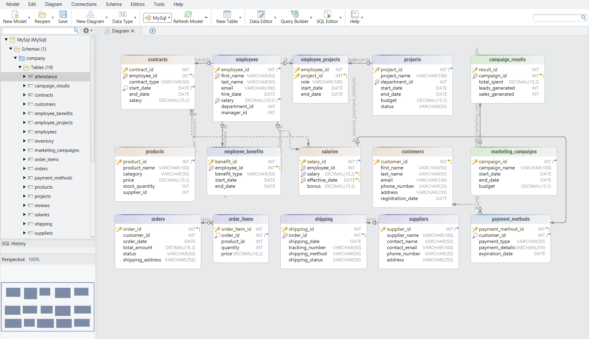
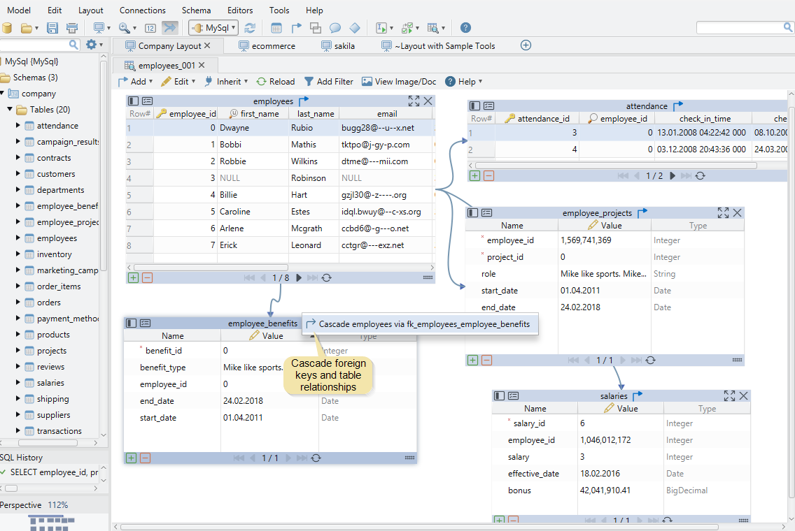
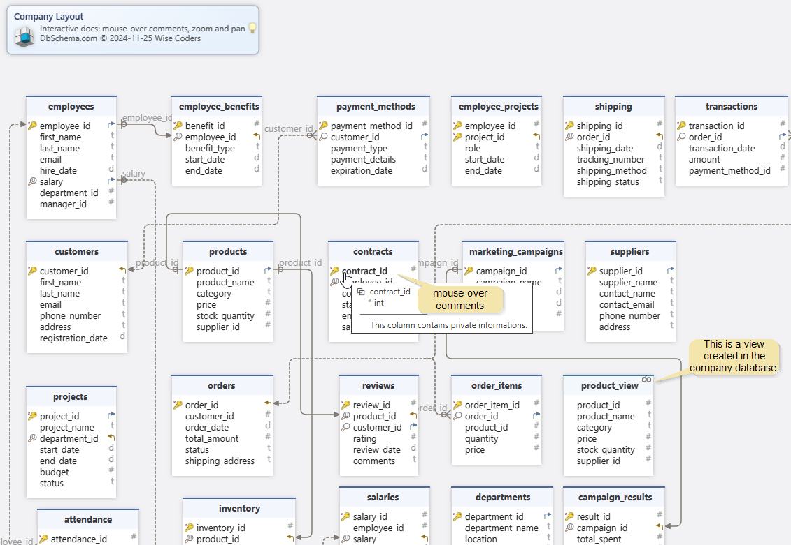
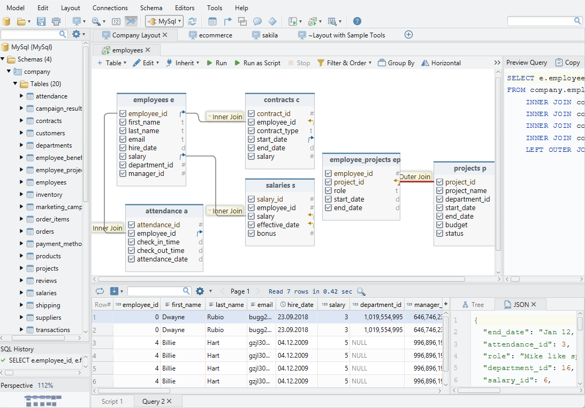

# DbSchema: Visual Database Designer & Management Tool
#### Simplify how you design, manage, and connect data.

## DbSchema

DbSchema is a desktop application for database design and management, designed for anyone who works with databases. It supports a wide range of relational and NoSQL databases accessible via JDBC, including MySQL, PostgreSQL, SQL Server, MongoDB, and 75 more.

DbSchema offers a free [Community Edition](https://dbschema.com/editions.html) and a [Pro Edition](https://dbschema.com/features.html), which includes advanced features and can be evaluated for free for 30 days.

DbSchema offers a range of features in the free edition including Schema Reverse Engineer, SQL Editor, and Visual Schema Design. With its intuitive interface, users can easily create tables, define foreign keys, and manage database structures.

Advanced features in the [Commercial Pro Edition](https://dbschema.com/purchase.html) include schema documentation with interactive diagrams, Git integration for team collaboration, and data generation tools. DbSchema works offline, allowing for efficient database modeling even without a direct connection to the database.

Find more details on the full [list of supported databases](https://dbschema.com/databases.html) in the official documentation.

It works on all major operating systems, including **Windows, Linux and macOS**.

[Download](https://dbschema.com/download.html)  DbSchema for free!

___
## DbSchema's Users

This repository is currently used to host the official issue & bug tracker for DbSchema.

Report bugs or request new features: [Issues](https://github.com/dbschema-pro/dbschema-pro/issues).

For community discussions, support, and feedback, visit our [Forum](https://github.com/dbschema-pro/dbschema-pro/discussions).

___
## DbSchema Overview
**DbSchema Model**: Design your database visually by creating tables, defining foreign keys, adding tags, comments, and more. The model is independent of the database, allowing you to work offline and sync changes later.

**Relational Data Editor**: Explore and edit data from multiple tables simultaneously, even without writing SQL code. Use foreign keys to navigate between related records easily.

**HTML5 Documentation**: Create interactive schema documentation with a vector diagram. Table and column comments appear as tooltips when you hover over them, making it easy to understand the structure and relationships in your database.

**Visual Query Builder**: Create complex SQL queries without writing code. Use an intuitive drag-and-drop interface to select tables, columns, and set conditions, making it easy to build queries visually. It also includes features like Group By, Filters, and Order By clauses.

Visit [DbSchema Official Website](https://dbschema.com) for more features and pricing.
____
### Feedback

- Follow us on [LinkedIn](https://www.linkedin.com/company/dbschema/) and watch our documentation videos on [YouTube](https://www.youtube.com/@dbschema.designer).
- Share your thoughts and leave a review about our product on platforms like [Product Hunt](https://www.producthunt.com/products/dbschema), [TrustRadius](https://www.trustradius.com/products/dbschema/reviews), [Capterra](https://www.capterra.com/p/203811/DbSchema/), [G2](https://www.g2.com/products/dbschema/reviews), etc.

___
DbSchema Team.

Author: Wise Coders GmbH
